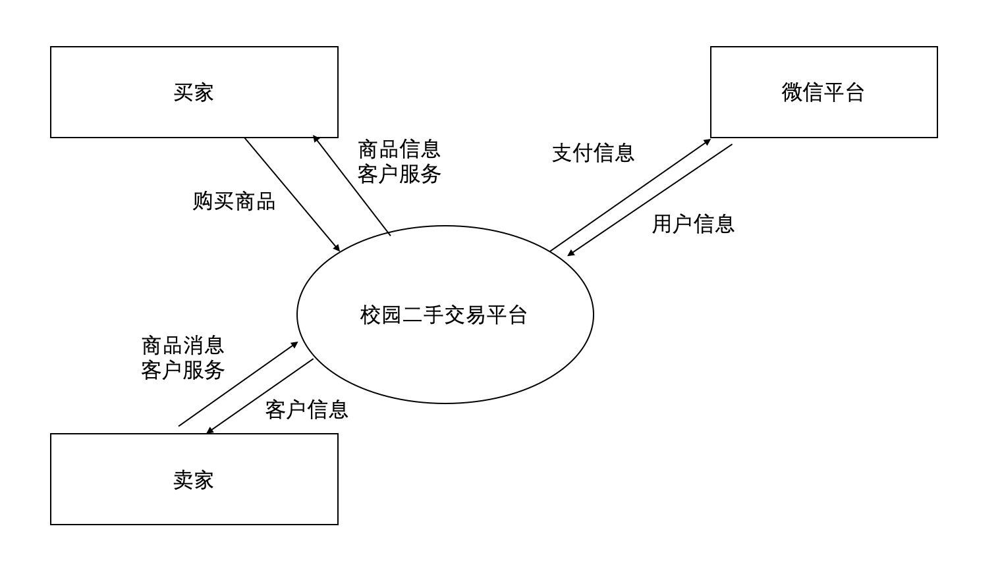

### 愿景与范围文档

#### 一、业务需求

1. **背景**

   ​	目前网上购物已经成为互联网时代的一大特色，它给人们带来了方便快捷的体验。而现在越来越多的C2C电子商务交易平台[2]被设计出来为喜爱网上购物的人服务。

   ​	在当今的大学校园中，大家都比较信赖和支持二手交易的。尤其是在开学季和毕业季的时候，开学季大家习惯于在二手交易市场购置一些新学期需要用到的书本，毕业季主要是一些毕业离校的学生急于出售自己难以带走而又有用的一些物品。

   ​	如今在大学生群体中，虽然电脑已经非常普及，但是学校一直缺少一个专业和集中的二手交易平台。大家闲置的物品只能通过建立校内二手物品交易QQ 群或者发小广告才能卖出去，可以说是极为不方便了。

2. **业务机遇**

   ​	在学生群体中，由于大多数学生都有相近的消费观和价值观，这为校园二手交易平台的发展提供了非常有力的条件。校内交易的话，由于是强关系社交，商品的质量和性价比都有保证。在学生群体中交易，商品基本都是学生所能用到的物品，而且价格都是在学生可接受的范围之内。对于竞品微信交易群，微信并没有提供便捷的二手交易功能，

3. **业务目标**

   ​	在一个学年内超过50%的软微师生通过微信链接浏览本平台，并且校内超过80%的二手交易通过本平台完成交易。

4. **成功指标**

   ​	浏览量，二手交易成交量。

5. **愿景声明**

   ​	面对学生群体的二手交易需求，校园二手交易平台是一个建立在强社交关系上的C2C购物平台，通过本平台学生不仅可以买到比一般网购更便宜的商品，还能把自己买了却用不上的物件变卖出去发挥更大的价值。不同于学生常用的二手交易群，本校园二手交易平台为广大学生提供一个便利、可靠、快捷的交易方式。不同于网上的二手交易平台，本校园二手交易平台建立在强关系社交圈内，在质量上和售后服务上有更大的保证。

6. **业务风险**

   平台操作流程过于复杂，导致用户直接选择其他二手交易渠道。

7. **业务假设和依赖**

   业务假设：大部分大学生的微信好友数量人均接近500人，这部分人都是潜在的买家或卖家。

   依赖：技术实现上依赖于微信相关的API。

范围和限制

1. 主要特性

   1. 提供二手商品的信息发布、浏览、购买等功能
   2. 提供买卖双方交流功能，无需加好友即可私密交流
   3. 利用微信的用户信息，无需额外注册
   4. 利用微信支付，收款、退款更有保障

2. 首次发布的范围

   完成商品发布、购买的功能

3. 之后发布的范围

   完成免加好友私密交流功能

4. 限制和不包括的内容

   不包括支付系统，不包括用户注册登录功能

业务环境

1. 利益相关人档案

   大学生：消费能力有限，开学时需要购置大量生活用品，毕业时有大量闲置物品；

   微信：一个在中国具有广泛用户的社交平台

2. 项目优先级

   动机：解决微信二手交易群的交流不方便，交易保障不足的问题

   约束：在微信平台上进行开发

   自由度：平台界面、交互方式

3. 部署考虑

   用户通过微信小程序的形式访问到本平台。

强关系社交：微信群、朋友圈

弱关系社交：知乎、淘宝买家秀、阿里旺旺

用户故事：

小软是软件与微电子学院的一个学生，他刚刚进入大兴校区，很多生活用品需要购买。但是他囊中羞涩，于是他通过同学推荐加入一个软微二手交易微信群。~~在群里学姐小微发了她想卖出的自行车的照片，还喊了一句有意请私聊。小软只好加了学姐微信。~~

在群里，学姐小微发了一个链接。小软点开后，看到了自行车的描述、价格等内容，他很心动，想买下来；在链接打开的网页里，小软直接能给学姐留言，还能砍砍价。

（1）大家谈好价格之后，小软买下了自行车。

（2）小软还是觉得自行车太贵，而且学姐长得不好看，~~聊完之后，小软把学姐微信删了。~~ 小软直接退出链接。

买了自行车没几天，小软发现自行车有大问题，想找学姐退款，~~找了半天找到学姐的微信后，发现学姐已经把小软从微信好友里删了。好不容易加回好友，学姐觉得是小软自己弄坏的，而且钱已经到账，坚决不肯退款。~~  小软于是通过平台跟学姐联系后，虽然学姐不肯，但是钱还在平台里，经过一番波折后，还是退款成功了。

小微是软件与微电子学院的一个研二学生，这学期她准备出去实习了，宿舍里还有很多东西搬不走，她打算放到二手群里卖出去。~~在群里小微发了她想卖出的自行车的照片，还喊了一句有意请私聊。一天内，超过十个人加了她的微信，不过有些人并不想买自行车，单纯想看小微朋友圈里的照片。为了卖出自行车，小微也就忍了。作为软微的交际花，做好朋友管理是必须滴。面对加了的每个人，小微都要手动添加交易标签。聊完之后，小微还得把他们删除好友，不然分不清谁是谁。~~ 小微发现了软微新推出了一个二手交易平台，买家卖家无需加好友即可私密聊天，不会有无聊的人借着交易的名号加好友了。在平台贴上自行车的描述后，小微把生成的链接发到二手群内，不久就有一个叫小软的学弟买下了这辆自行车。

### 系统关联图

